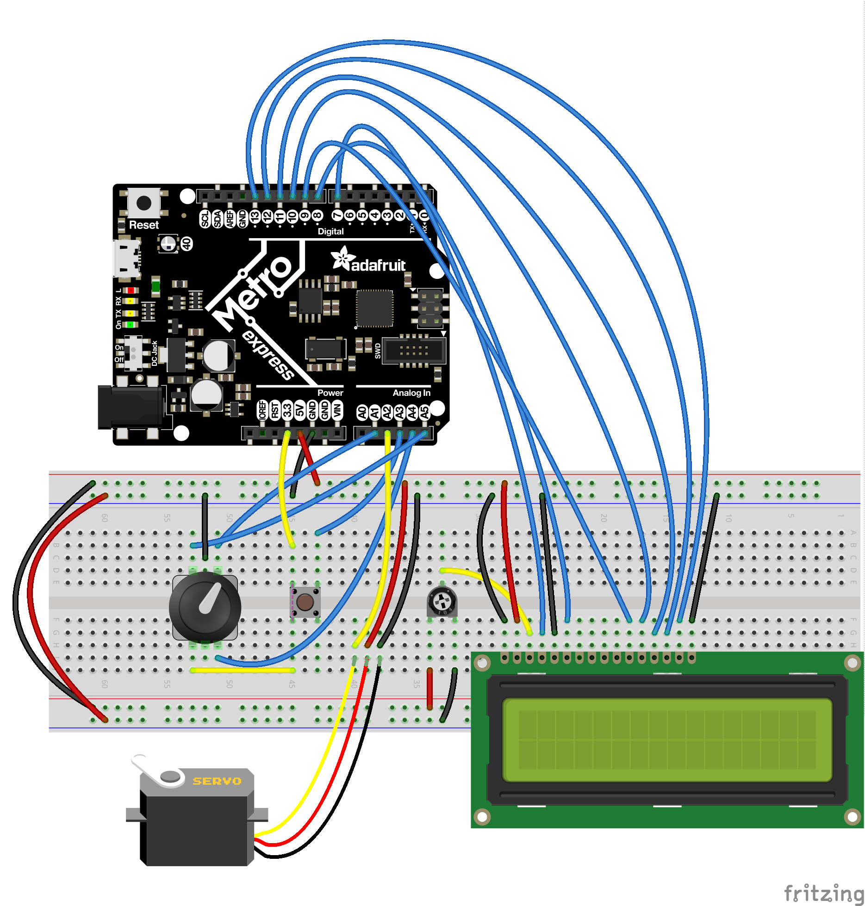

# buttonpusher

This "buttonpusher" is a 3D-printed machine that, you guessed it!, pushes the "A" button of a Nintendo Joy-Con Switch at pre-programmed sequences for variable number of times.

buttonpusher is 3D-printed and made from off-the-shelf electronics from Adafruit. It requires no modifications to the Nintendo gear.

**Blog post:** [https://blog.tommy.sh/posts/buttonpusher/](https://blog.tommy.sh/posts/buttonpusher/)  
**Video:** [https://vimeo.com/427842316](https://vimeo.com/427842316)

## Sequences

I made this specifically for Animal Crossing, where you sometimes need to [craft a whole bunch of something](https://animalcrossing.fandom.com/wiki/DIY_recipes) and it takes a long time and is super boring... but it could be easily extended for other games or usages, as long as the only button required to push is "A" and the sequence timing is fixed!

Here's what's baked in currently:

* **Craft Item**: craft an item at a DIY workbench
* **Purchase Item**: buy an item at Nook's Cranny
* **Bell Voucher**: exchange Nook Miles for Bell Vouchers at the [Nook Stop terminal](https://animalcrossing.fandom.com/wiki/Nook_Stop)
* **Wish on Stars for 1 Minute**: for use during a [meteor shower](https://animalcrossing.fandom.com/wiki/Meteor_shower)
* **Debug**: ...for testing!

## Make Your Own

### Parts

This repo has the CircuitPython code used for the microcontroller, the 3D-printed models, as well as the OpenSCAD code used to make those models.

Beyond that, you will need:

* [Micro servo](https://www.adafruit.com/product/169)
* [Adafruit Metro M0 Express](https://www.adafruit.com/product/3505) (or a similar microcontroller)
* Character LCD (I used [this](https://www.jameco.com/shop/ProductDisplay?catalogId=10001&langId=-1&storeId=10001&productId=2295423) but any 16x2 should work great)
* [Rotary encoder w/ button](https://www.adafruit.com/product/377) to select the sequence and the number of times to run it
* Tactile button to cancel sequence
* Potentiometer to adjust LCD contrast

### Fritzing Circuit

### Deployment

Unlike regular CircuitPython projects, the `.py` files here need to be compiled into `.mpy` with [mpy-cross](https://learn.adafruit.com/building-circuitpython/build-circuitpython) before being copied over. Without that, memory on the board is quickly exhausted.

Once that's done, copy `main.py` and the `lib` folder onto the device over USB.

### Assembly

1. Insert servo into its mounting cavity -- it should fit snugly and won't need its screws
2. Attach the one-sided servo horn into the 3D-printed hammer arm, and attach that to the servo axle
3. Optionally, use machine screws to mount everything together
4. Slide Joy-Con into mount

### Usage

Once everything is installed and the circuit is assembled:

1. Turn rotary encoder to cycle through sequences
2. Press rotary encoder _in_ to confirm selection
3. Do the same to select the count of times to run sequence
4. Use tactile button to cancel sequence or navigate back in menu

## License

MIT License

Copyright (c) 2020

Permission is hereby granted, free of charge, to any person obtaining a copy
of this software and associated documentation files (the "Software"), to deal
in the Software without restriction, including without limitation the rights
to use, copy, modify, merge, publish, distribute, sublicense, and/or sell
copies of the Software, and to permit persons to whom the Software is
furnished to do so, subject to the following conditions:

The above copyright notice and this permission notice shall be included in all
copies or substantial portions of the Software.

THE SOFTWARE IS PROVIDED "AS IS", WITHOUT WARRANTY OF ANY KIND, EXPRESS OR
IMPLIED, INCLUDING BUT NOT LIMITED TO THE WARRANTIES OF MERCHANTABILITY,
FITNESS FOR A PARTICULAR PURPOSE AND NONINFRINGEMENT. IN NO EVENT SHALL THE
AUTHORS OR COPYRIGHT HOLDERS BE LIABLE FOR ANY CLAIM, DAMAGES OR OTHER
LIABILITY, WHETHER IN AN ACTION OF CONTRACT, TORT OR OTHERWISE, ARISING FROM,
OUT OF OR IN CONNECTION WITH THE SOFTWARE OR THE USE OR OTHER DEALINGS IN THE
SOFTWARE.
